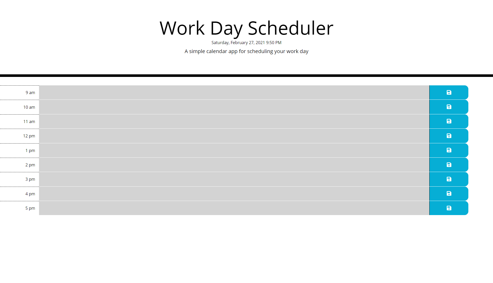

# Word Day Scheduler

## Overview

For this project, I focused on using JavaScript. It definitely could have been a bit simpler but I wanted to push myself to further my knowledge.

HTML 
For the HTML file, I created a simple outline with a main section.

JavaScript
For my JavaScript file, I started by formatting the current time and date. Next I created the desired work hour time slots. Then I made an HTML section within my JS file and an onload function that iterates through the time slots and creates a section for each time slot. Next, I made an event that saves text to the page once you've added it. I next made it so text saves to local storage and displays on the screen when the page is reloaded.Lastly, I made it so the background color of each section changes based on if the section hour is before, during or after the current hour.

CSS
For the CSS file, I was quickly able to align, color and format everything I wanted.  I spent the most time resizing the rows and figuring out how to resize an icon.

## Link to deployed website

## Screenshot

